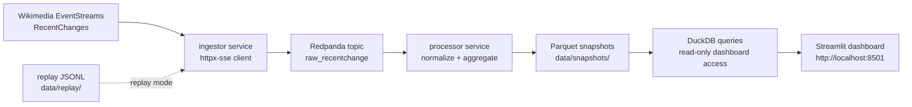

# WikiStream Observatory

Real-time observability for Wikimedia RecentChanges activity, automation patterns, and review workload.

WikiStream Observatory is a local, Docker Compose-based data engineering showcase. It reads the public Wikimedia RecentChanges stream, moves events through a Kafka-compatible broker, processes them into normalized facts and windowed metrics, writes local analytical snapshots, and presents the results in a Streamlit dashboard.

The project is read-only. It does not write to Wikimedia, block edits, report users, or make enforcement decisions.

## Why this exists

Wikimedia projects rely on both human contributors and automation. Bots can perform useful maintenance at high speed, and edit-review workflows need operational context across many wikis. A raw global event stream is difficult to interpret directly, so this project turns public RecentChanges events into reviewer-friendly observability signals:

- what edit activity is happening now;
- which Wikimedia domains are most active;
- how much activity is bot-flagged versus non-bot;
- whether activity is fresh, stale, live, or replayed;
- eventually, where domain-level bot activity is unusual relative to a recent baseline.

The goal is transparency and data engineering practice, not enforcement or accusation.

## Current implementation status

The current completed slice supports:

- live Wikimedia RecentChanges ingestion;
- replay/sample data mode from bundled JSONL records;
- Redpanda/Kafka-compatible raw event transport;
- RecentChanges normalization for required dashboard fields;
- 1-minute activity metrics;
- domain-level bot spike signal snapshots and dashboard section;
- replay data-quality snapshot counts for the bundled malformed/rejected and missing-field examples;
- Parquet snapshots queried through DuckDB helpers;
- a Streamlit dashboard showing mode, freshness, event volume, top domains, event types, bot/non-bot share, and bot spike signals;
- empty-state handling for missing snapshots;
- local Docker Compose execution.

Still planned for later MVP phases:

- fuller live data-quality dashboard section and freshness classification tests;
- Makefile/development helper commands.

## Architecture

MVP flow:



Text equivalent:

```text
Wikimedia EventStreams RecentChanges
  -> ingestor service
  -> Redpanda topic: raw_recentchange
  -> processor service
  -> Parquet snapshots under data/snapshots/
  -> DuckDB snapshot queries
  -> Streamlit dashboard at http://localhost:8501
```

Replay mode uses the same processor/dashboard path, replacing the live EventStreams source with bundled JSONL records under `data/replay/`.

### Main services

- `redpanda`: single-node Kafka-compatible broker.
- `ingestor`: connects to Wikimedia EventStreams in live mode and publishes raw RecentChanges envelopes.
- `processor`: consumes raw events, normalizes them, computes overview metrics, and writes snapshots.
- `dashboard`: reads snapshots through DuckDB helpers and renders Streamlit views.

### Local storage

Generated analytical data is written under `data/snapshots/`. These files are runtime artifacts and are excluded from git.

## Prerequisites

- Docker and Docker Compose.
- Internet access for live mode.
- No Wikimedia account, credentials, paid API is required.

Expected local ports:

- Streamlit dashboard: `http://localhost:8501`
- Redpanda Kafka API for optional local debugging: `localhost:19092`

## Live quickstart

Start the local stack:

```bash
docker compose up --build
```

Open the dashboard:

```text
http://localhost:8501
```

Expected live behavior within a few minutes:

- dashboard mode is `live`;
- event volume over time begins to populate;
- top Wikimedia domains are shown;
- event type breakdown is shown;
- bot/non-bot share is shown;
- latest observed event time is visible;
- live data is marked fresh only when the latest observed event is within the configured freshness window, currently 60 seconds.

If snapshots do not exist yet, the dashboard should show an empty/no-data state while the ingestor and processor catch up.

## Replay quickstart

Start the local stack with bundled representative sample data:

```bash
WIKISTREAM_MODE=replay docker compose up --build
```

Replay mode publishes records from `data/replay/recentchange_sample.jsonl`, labels generated snapshots as `source_mode = replay`, and ensures dashboard freshness text does not present replayed data as current live Wikimedia activity.

Expected replay behavior within 2 minutes:

- dashboard mode is `replay`;
- overview metrics populate from bundled sample records;
- a domain-level bot spike signal appears for `example.wikipedia.org`;
- replay data-quality snapshots contain 28 accepted records, 1 accepted missing-field record, and 2 malformed/rejected records;
- freshness/status text states that replay data is demonstration/sample data, not current live Wikimedia activity.

## Dashboard guide

The current dashboard includes:

### Mode and freshness

Shows whether the stack is configured for `live` or `replay`, the latest observed event timestamp, and freshness status. Live data is fresh only when the latest event is recent enough according to `WIKISTREAM_FRESHNESS_SECONDS`.

### Live/replay activity overview

Shows:

- events per minute;
- top active Wikimedia domains;
- RecentChanges event type breakdown;
- bot/non-bot share based on Wikimedia's source-provided `bot` flag.

### Empty states

If no snapshots are available, the dashboard should remain usable and instruct the reviewer to start live ingestion or replay mode rather than failing with a raw error page.

### Domain-level bot spike signal

Shows domain-first bot activity spike signals using a current-vs-baseline comparison. Top contributing bot labels, when shown, are context only and are accompanied by limitation text.

### Planned MVP sections

Later MVP phases will add a fuller data-quality dashboard section for malformed/rejected records and accepted records with missing fields.

## Cleanup

Remove generated snapshots between local runs:

```bash
rm -rf data/snapshots/*
```

Do not delete bundled replay data under `data/replay/`.

To stop containers:

```bash
docker compose down
```

To also remove the local Redpanda Docker volume:

```bash
docker compose down -v
```

## Configuration

Copy or inspect `.env.example` for available settings. Important variables include:

| Variable | Purpose | Default |
| --- | --- | --- |
| `WIKISTREAM_MODE` | `live` or `replay` | `live` |
| `WIKISTREAM_KAFKA_BOOTSTRAP_SERVERS` | Kafka/Redpanda bootstrap address inside Docker | `redpanda:9092` |
| `WIKISTREAM_RAW_TOPIC` | Raw RecentChanges topic | `raw_recentchange` |
| `WIKISTREAM_SNAPSHOT_PATH` | Container snapshot path | `/app/data/snapshots` |
| `WIKISTREAM_REPLAY_PATH` | Replay JSONL path | `/app/data/replay/recentchange_sample.jsonl` |
| `WIKISTREAM_USER_AGENT` | Descriptive User-Agent for Wikimedia live requests | `wikistream-observatory-local/0.1` |
| `WIKISTREAM_FRESHNESS_SECONDS` | Live freshness threshold | `60` |
| `WIKISTREAM_SNAPSHOT_INTERVAL_SECONDS` | Processor snapshot interval | `15` |
| `WIKISTREAM_DASHBOARD_REFRESH_SECONDS` | Dashboard refresh/query target | `15` |
| `WIKISTREAM_LIVE_RETENTION_HOURS` | Generated live snapshot retention target | `6` |

Signal-related variables configure the bot spike implementation: `WIKISTREAM_SIGNAL_CURRENT_WINDOW_MINUTES`, `WIKISTREAM_SIGNAL_BASELINE_WINDOW_MINUTES`, `WIKISTREAM_SIGNAL_THRESHOLD_RATIO`, `WIKISTREAM_SIGNAL_MIN_EVENTS`, and `WIKISTREAM_SIGNAL_TOP_BOTS_LIMIT`.

## Wikimedia validation findings

Validation recorded on 2026-06-05 in `specs/001-wikistream-mvp-slice/research.md` found:

- `https://stream.wikimedia.org/v2/stream/recentchange` returned HTTP 200 with `content-type: text/event-stream`.
- The current RecentChange schema endpoint was reachable at `https://schema.wikimedia.org/repositories/primary/jsonschema/mediawiki/recentchange/latest` and described fields including `meta`, `type`, `namespace`, `title`, `timestamp`, `user`, `bot`, `minor`, `patrolled`, `length`, `revision`, and `comment`.
- Wikimedia EventStreams, User-Agent policy, and MediaWiki bot documentation pages were reachable.
- Implementation should use a descriptive User-Agent, perform client-side filtering/normalization, treat the Wikimedia `bot` flag as a source-provided activity attribute, and avoid enforcement-oriented interpretation.

## Responsible use and limitations

WikiStream Observatory presents observability signals, not proof of misuse.

Important limits:

- The system is read-only and does not write to Wikimedia.
- Metrics are derived from live or replayed RecentChanges events observed locally; they are not a historical backfill.
- The `bot` field is a source-provided flag and should not be treated as a complete explanation of intent, risk, or legitimacy.
- Missing or malformed fields may affect metrics; replay quality snapshots expose the bundled sample counts, and a fuller dashboard section is planned.
- Bot spike output is domain-level context. Optional top contributing bot labels, if shown, are contextual and are not account-level accusations.
- Stale live data must not be interpreted as current activity.
- Replay data must be interpreted as demonstration data, not current Wikimedia activity.

Avoid interpreting this project as a moderation tool, abuse detector, replacement for Wikimedia review systems, or claim that an individual user or bot is doing something wrong. Stream-derived signals require contextual review.

## Development checks

Core logic checks use pytest:

```bash
uv run pytest
```

If not using uv, install the project with development dependencies in a Python 3.12 environment and run:

```bash
pytest
```

Docker configuration can be checked with:

```bash
docker compose config
```
